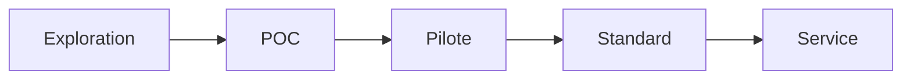

# Innovation Status

## Statut actuel du projet
- [ ] Exploration
- [x] POC
- [ ] Pilote
- [ ] Standard interne
- [ ] Service production

- **Date de création**: 2026-02-24
- **Responsable**: Équipe AI Security
- **Prochaine étape attendue**: Pilote contrôlé sur un flux email finance réel (sandbox).

## Critères de passage au niveau supérieur (POC → Pilote)
1. Journal d’audit exploitable (décision router, justification, résultat).
2. KPI #1 validé à 100% sur jeu de tests d’injection.
3. Revue sécurité et conformité validée.
4. Formation utilisateur sur la notion “ordre explicite”.

## Risques identifiés
- Faux négatifs de classification (requête mal routée).
- Surconfiance utilisateur dans un résumé incomplet.
- Mauvaise intégration des permissions côté Exécutant.

