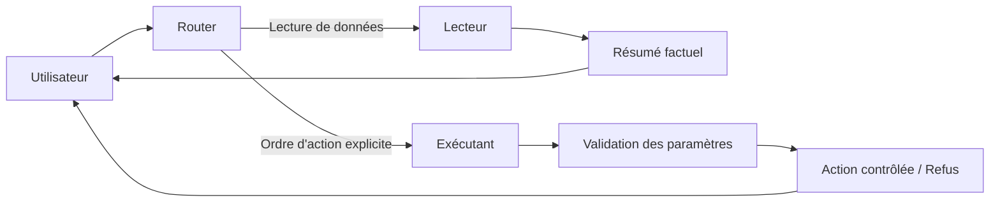

# Architecture

## Vue d’ensemble

## Règles d’architecture
- **R1**: Le Lecteur ne possède aucun droit d’action.
- **R2**: L’Exécutant ignore les ordres présents dans les données sources.
- **R3**: Toute action est conditionnée à un ordre utilisateur explicite.
- **R4**: En cas d’ambiguïté, le système retourne une demande de clarification.

## Intégration optionnelle NeMo Guardrails

Le pipeline inclut un point d'extension `evaluate_untrusted_content` qui reste déterministe par défaut (fallback local), puis active un mode de durcissement si `nemoguardrails` est disponible et si `NEMO_GUARDRAILS_ENABLED=1`.
